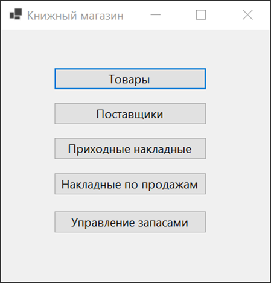
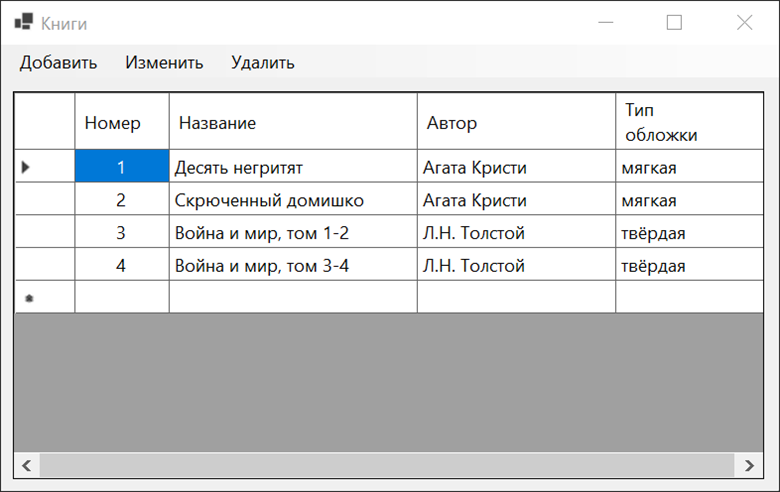
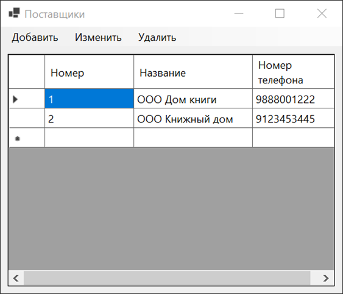
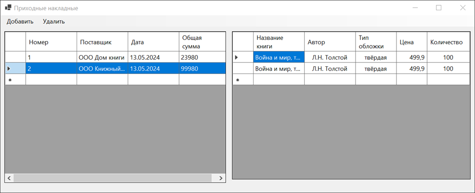
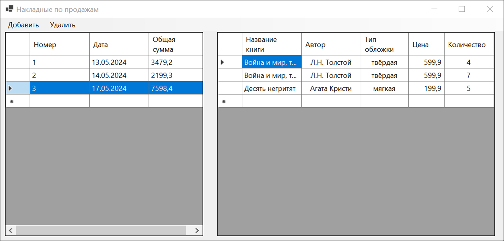
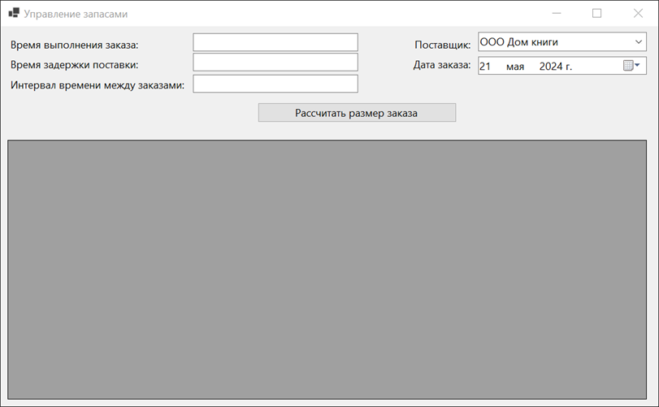
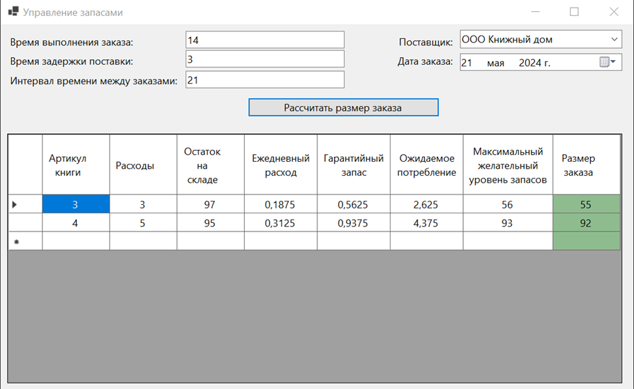

# Управление запасами книжной продукции

**Используемые технологии:**
- язык программирования ***C#***
- интерфейс ***.NET Windows Forms***
- база данных ***PosgeSQL***
- библиотека для работы с базой данных ***Npgsql***

**Основные функции приложения:**
- работа с данными о товарах
- работа с данными о поставщиках
- сохранение данных о поставках
- сохранение данных о продажах
- расчёт размера заказа по системе фиксированным интервалом времени между заказами

## Интерфейс приложения
*Главная страница*

*Раздел Товары*

*Раздел Поставщики*

*Раздел Приходные накладные*

*Раздел Накладные по продажам*

*Раздел Управление запасами*

*Расчёт размера заказа*

